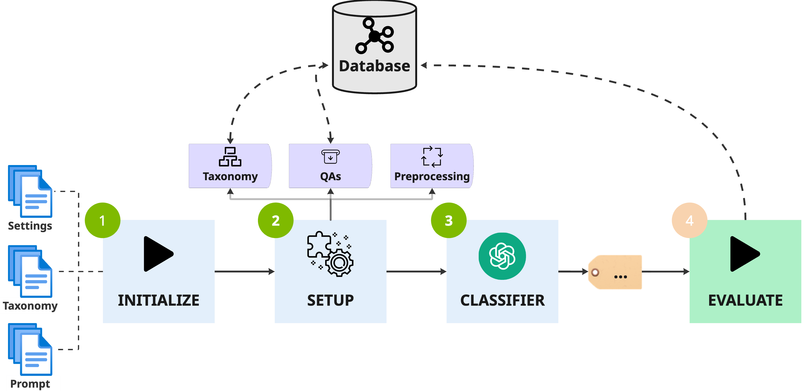
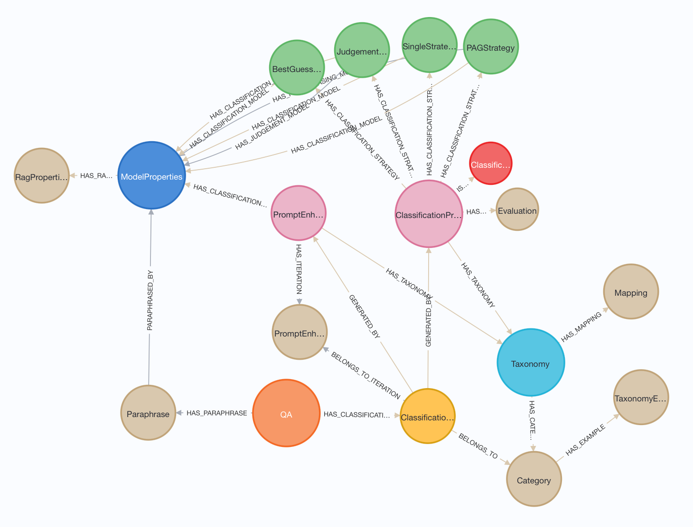

# Clarity Pipeline

> End-to-end orchestration layer for **LLM classification experiments**.  
> Integrates Neo4j, multi-provider LLMs, and evaluation tooling under one unified Java module.

---

## Table of Contents

- [Overview](#overview)
- [Features](#features)
- [Architecture](#architecture)
- [Services](#services)
    - [Classification Pipeline](#classification-pipeline)
    - [Dataset Management](#dataset-management)
    - [Evaluation Export](#evaluation-export)
    - [Embedding Service](#embedding-service)
    - [Prompt Enhancement](#prompt-enhancement)
- [Strategies](#strategies)
    - [Single Strategy](#single-strategy)
    - [Judgement Strategy](#judgement-strategy)
    - [Best Guess Strategy](#best-guess-strategy)
    - [Discussion Strategy](#discussion-strategy)
    - [PAG Strategy](#pag-strategy)
- [Configuration](#configuration)
    - [ClassificationProperties](#classificationproperties)
    - [Strategy Configuration](#strategy-configuration)
    - [Model Properties](#model-properties)
    - [Taxonomy](#taxonomy)
    - [Evaluation](#evaluation)
    - [General](#general)
- [Usage](#usage)
    - [1. Prepare Your Environment](#1-prepare-your-environment)
    - [2. Configure a Run](#2-configure-a-run)
    - [3. Execute the Pipeline](#3-execute-the-pipeline)
    - [4. Export Results](#4-export-results)
- [APIs](#apis)
- [Graph Ontology](#graph-ontology)
- [Tree Structure](#tree-structure)

---

## Overview

The **Clarity Pipeline** forms the backbone of the Clarity classification framework.
It provides an extensible runtime that connects data, ontology, model inference, and evaluation.

## Features

- **Multi-Provider LLM Support**: Unified interface for OpenAI, Anthropic, Together, and local models
- **Graph-Based Persistence**: Complete provenance tracking in Neo4j with versioned experiments
- **Flexible Classification Strategies**: Single-shot, judgement, best-guess, discussion, and PAG approaches
- **RAG Integration**: Dynamic few-shot example retrieval based on embedding similarity
- **Automated Prompt Enhancement**: LLM-driven iterative refinement of prompts and taxonomies
- **Comprehensive Evaluation**: Accuracy, precision, recall, macro/micro F1 with Excel export
- **Parallel Execution**: Thread pooling, automatic retries, and configurable batch processing
- **Config-Driven Workflows**: YAML-based reproducible experiments without code changes

---

## Requirements

> Before implementing the initial pipeline the following requirements were defined to ensure the necessary
> functionality and extensibility of the system.

- **R1 – End-to-End Classification Flow**
    - The system shall perform full inference runs from dataset loading to evaluation output in a single orchestrated
      process.
- **R2 - Persistence in Database**
    - The system shall store datasets, taxonomies, model configurations, predictions, and evaluations in database for
      future retrieval and analysis.
- **R3 - Multi-Provider LLM Support**
    - The system shall support multiple LLM providers (e.g., OpenAI, Anthropic, Together, locally hosted) through a
      unified client interface.
- **R4 - Config Driven Execution**
    - The system shall allow all aspects of the classification pipeline to be configured via external YAML files,
      enabling reproducible experiments and dynamic adjustments without code changes.

---

## Architecture



| Layer                      | Responsibility                                                                                                                                |
|----------------------------|-----------------------------------------------------------------------------------------------------------------------------------------------|
| **Service Layer**          | Orchestrates the end-to-end flow (`ClassificationPipeline`, `EvaluationExporter`, `DatasetImporter`, `CleanedDataImporter`, `PromptEnhancer`) |
| **Client Layer**           | Connects to LLM providers via a unified `Client` contract                                                                                     |
| **Strategy Layer**         | Defines classification logic (`SingleStrategy`, `JudgementStrategy`, `BestGuessStrategy`, `DiscussionStrategy`, `PagStrategy`)                |
| **Model Configs**          | Encapsulate provider-specific options, prompts, and sampling params (`OpenAIClient`, `LocalClient`, `AnthropicClient`, `TogetherClient`)      |
| **Ontology Layer (Neo4j)** | Stores QA data, taxonomies, runs, and evaluation metrics                                                                                      |
| **Utility Layer**          | Shared helpers for prompts, embeddings, and data I/O                                                                                          |

---

## Services

### Classification Pipeline

**Main Entry Point**: [
`ClassificationPipeline`](src/main/java/de/tum/claritypipeline/service/ClassificationPipeline.java)

The core orchestrator for classification experiments. Coordinates the complete workflow from data retrieval to metric
generation.

#### Workflow

```
1. Fetch QAs from Neo4j (filtered by configured query)
   ↓
2. Filter Already Classified (avoid duplicates)
   ↓
3. Parallel Classification (configurable thread pool)
   ↓
4. Category Matching (map predictions to taxonomy)
   ↓
5. Batch Persistence (save results + relationships)
   ↓
6. Evaluation Generation (compute metrics)
```

#### Key Features

- **Parallel Processing**: Configurable worker threads for high-throughput classification
- **Automatic Retries**: Exponential backoff for transient failures
- **Flexible Querying**: Cypher queries to select specific dataset splits or filters
- **Strategy Agnostic**: Works with any `ClassificationStrategy` implementation
- **Full Provenance**: Links QA → ClassificationResult → Strategy → Evaluation in Neo4j

#### Example Usage

```java
public static void main(String[] args) {
    ClassificationPipeline pipeline = new ClassificationPipeline("properties/gpt-4.1.yaml");
    pipeline.classify(); // Executes complete workflow
}
```

---

### Dataset Management

#### Dataset Graph Importer

**Service**: [`DatasetGraphImporter`](src/main/java/de/tum/claritypipeline/service/DatasetGraphImporter.java)

Handles initial import of QA datasets from JSON files into Neo4j. Implements upsert logic to support both fresh imports
and incremental updates.

**Features**:

- **Upsert Strategy**: Updates existing nodes or creates new ones based on index + split flags
- **Parallel Import**: Thread-safe batch processing for large datasets
- **Split Tagging**: Automatically sets `test`/`valid`/`train` boolean flags
- **Metadata Preservation**: Imports all QA properties (questions, answers, labels, annotations)

**Usage**:

```java
public static void main(String[] args) {
    DatasetGraphImporter importer = new DatasetGraphImporter();
    List<QA> dataset = new DatasetReader().readDataset(DatasetType.TRAIN);
    importer.importDataset(dataset);
}
```

#### Cleaned Data Importer

**Service**: [`CleanedDataImporter`](src/main/java/de/tum/claritypipeline/service/CleanedDataImporter.java)

Updates existing QA nodes with cleaned/normalized versions of interview questions and answers.

**Features**:

- **Targeted Updates**: Only modifies `interviewQuestionClean` and `interviewAnswerClean` fields
- **Non-Destructive**: Preserves all other node properties and relationships
- **Parallel Execution**: Efficient batch updates for large datasets

**Usage**:

```java
public static void main(String[] args) {
    CleanedDataImporter importer = new CleanedDataImporter();
    List<QA> cleanedData = new DatasetReader().readDataset("cleaned/train.json");
    importer.importCleanedData(cleanedData);
}
```

#### Dataset Reader

**Service**: [`DatasetReader`](src/main/java/de/tum/claritypipeline/service/DatasetReader.java)

Flexible JSON dataset loader with automatic split tagging and configurable base paths.

**Features**:

- **Standard Splits**: Built-in support for train/valid/test.json
- **Custom Files**: Load any JSON with explicit or generic type tagging
- **Configurable Path**: Custom base directory for dataset location
- **Automatic Tagging**: Sets split membership flags on all loaded QAs

**Usage**:

```java
DatasetReader reader = new DatasetReader("../clarity-dataset/data/full");
List<QA> trainData = reader.readDataset(DatasetType.TRAIN);
List<QA> customData = reader.readDataset("custom-split.json", DatasetType.GENERIC);
```

---

### Evaluation Export

**Service**: [`EvaluationExporter`](src/main/java/de/tum/claritypipeline/service/EvaluationExporter.java)

Comprehensive export utility for classification results in multiple formats.

#### Export Formats

**1. Excel Workbook** (Aggregated Metrics)

- One row per classification version
- Columns: Name, Version, Accuracy, Precision, Recall, Macro F1, Micro F1
- Configurable formatting (borders, number formats, header styles)
- Optional value rounding

```java
public static void main(String[] args) {
    EvaluationExporter exporter = EvaluationExporter.create();
    exporter.exportAsExcel("results/evaluation-2025-01-12.xlsx");
}
```

**2. Competition ZIP** (Predictions)

- Plain text file named "prediction"
- One label per line (ordered by QA index)
- Automatic label mapping if taxonomy mapping enabled
- Ready for competition submission

```java
public static void main(String[] args) {
    exporter.exportResult("properties/gpt-5.1.yaml", "predictions/run1.zip");
}
```

**3. Custom Multi-Label Evaluation**

- Considers multiple annotators per QA
- Computes multi-label macro F1 for evasion-level analysis
- Filters incomplete annotations automatically
- Useful for fine-grained evaluation scenarios

```java
public static void main(String[] args) {
    exporter.generateCustomEvaluation("properties/gpt-5.1.yaml");
}
```

#### Configuration Options

Control export behavior via [
`EvaluationExportProperties`](src/main/java/de/tum/claritypipeline/model/config/EvaluationExportProperties.java):

```yaml
sheet-name: "Evaluation Results"
round-to-digits: 3          # Decimal places for rounding
header-font-size: 12        # Excel header font size
number-format: "0.00"       # Excel number format string
```

---

### Embedding Service

**Service**: [`EmbeddingService`](src/main/java/de/tum/claritypipeline/service/EmbeddingService.java)

Manages vector embeddings for RAG-enabled classification strategies.

#### Features

- **Batch Embedding Generation**: Parallel processing of QA datasets
- **Multi-Field Embeddings**: Separate vectors for question, answer, and combined text
- **Neo4j Integration**: Automatic index creation and similarity search
- **Caching**: Skips already-embedded QAs to avoid redundant API calls

#### Supported Embedding Indices

Defined in [`EmbeddingIndex`](src/main/java/de/tum/claritypipeline/model/config/EmbeddingIndex.java):

- `qa_question`: Question text only
- `qa_answer`: Answer text only
- `qa_question_and_answer`: Combined question + answer

#### Usage

```java
public static void main(String[] args) {
    // Initialize service
    EmbeddingService.initialize(neo4jCredentials, "text-embedding-3-large");

    // Generate embeddings for all QAs
    String query = "MATCH (n:QA) WHERE n.train = true RETURN n";
    EmbeddingService.

            getInstance().generateEmbeddingsForQAs(query);

    // Search similar QAs
    double[] queryEmbedding = EmbeddingService.getInstance().generateEmbeddings("example question");
    List<Neo4jEmbeddingSearchResult<QA>> similar =
            EmbeddingService.getInstance().searchSimilar("qa_question_and_answer", queryEmbedding, 5, QA.class);
}
```

---

### Prompt Enhancement

**Service**: [`PromptEnhancer`](src/main/java/de/tum/claritypipeline/service/PromptEnhancer.java)

LLM-driven iterative refinement system for prompts and taxonomies based on
the [OpenAI GPT 5.1 Prompting Guide](https://cookbook.openai.com/examples/gpt-5/gpt-5-1_prompting_guide#how-to-metaprompt-effectively).

#### Enhancement Process

The enhancer operates in iterative cycles, each with three phases:

**1. Classification Phase**

```
Select N Unused QAs
   ↓
Classify with Current Prompt & Taxonomy
   ↓
Compare Predictions vs. Ground Truth
   ↓
Persist Results to Neo4j with Iteration Links
```

**2. Diagnosis Phase**

```
Identify Misclassified QAs (Failures)
   ↓
Format Failure Traces:
   - Original Question & Answer
   - Assigned (Incorrect) Category
   - Expected (Correct) Category
   - Model's Explanation
   ↓
LLM Analyzes Failure Patterns
   ↓
Generate Structured Failure Analysis:
   - Failure Mode Name & Description
   - Problematic Prompt Sections (Drivers)
   - Explanation of Why Each Driver Matters
```

**Example Failure Mode**:

```
Failure Mode: Ambiguous Boundary Instructions
Description: The prompt's category definitions overlap, causing confusion
Prompt Drivers:
  - "The information is given but not explicitly stated": Too vague, applies to multiple categories
  - Why it matters: Both "Implicit" and "Partial/half-answer" involve unstated information
```

**3. Patch Phase**

```
LLM Receives:
   - Failure Mode Analysis
   - Current Prompt
   - Current Taxonomy
   ↓
LLM Proposes Improvements:
   - Revised Prompt (clearer instructions)
   - Refined Taxonomy (better descriptions/examples)
   - Patch Notes (explanation of changes)
   ↓
Validate No New Categories Added
   ↓
Apply Changes for Next Iteration
```

#### Configuration

Enhancement runs are defined via [
`PromptEnhancingProperties`](src/main/java/de/tum/claritypipeline/model/config/PromptEnhancingProperties.java):

```yaml
name: "gpt-5.1-enhancement"
version: "v1"
iterations: 5                    # Number of enhancement cycles
n: 20                           # QAs to classify per iteration
worker-threads: 8               # Parallel classification threads
attempts: 3                     # Retry attempts for failed LLM calls

output-prompt: "../output/enhanced-prompt.yaml"      # Final prompt output
output-taxonomy: "../output/enhanced-taxonomy.yaml"   # Final taxonomy output

taxonomy: "../assets/taxonomy/clarity-categories.yaml"
neo4j-credentials: "../clarity-neo4j/src/main/resources/neo4j-credentials.yaml"

query: |                        # Dataset query for sampling QAs
  MATCH (n:QA)
  WHERE n.train = true
  RETURN n

model: # LLM for classification & enhancement
  provider: "openai"
  name: "gpt-4.1"
  response-format: "json_object"

classification-prompt: "../assets/prompts/few-shot.yaml"
enhancement-prompt-diagnose: "../assets/prompts/diagnose.yaml"
enhancement-prompt-patch: "../assets/prompts/patch.yaml"
```

#### Termination Conditions

Enhancement stops when:

1. **Configured Iterations Reached**: Maximum cycles completed
2. **All Classifications Correct**: No failures detected (perfect accuracy)
3. **Dataset Exhausted**: No more unused QAs available

#### Output Files

If configured, writes:

- **Enhanced Prompt** (`output-prompt`): YAML-wrapped or plain text
- **Refined Taxonomy** (`output-taxonomy`): Complete YAML structure

#### Usage

```java
public static void main(String[] args) {
    PromptEnhancer enhancer = new PromptEnhancer("prompt-enhancing/gpt-5.1.yaml");
    enhancer.enhance();
    // Results stored in Neo4j and exported to configured files
}
```

---

## Strategies

The pipeline supports multiple classification strategies that define how LLMs are used to classify question-answer
pairs. Each strategy implements a different approach to leverage model capabilities, improve robustness, or handle
ambiguous cases.

### Single Strategy

**Single-model classification with a single API call.**

The `SingleStrategy` is the most straightforward approach, making one request to a configured LLM and returning its
prediction directly. This serves as the baseline for comparing more complex strategies.

#### Workflow

```
Input: Question & Answer
   ↓
Model (single call)
   → Prediction: Category Name
   → Optional: Explanation, Confidence
   ↓
Output: Classification Result
```

#### Key Features

- **Simplicity**: One API call per classification
- **Flexibility**: Supports both JSON and plain text responses
- **Client Adaptation**: Automatically handles LocalClient (structured JSON input) vs. remote clients (prompt templates)
- **Cost-Effective**: Minimal token usage for high-volume classification

#### Use Cases

- Standard classification tasks with a single model
- Baseline experiments for benchmarking
- Low-latency requirements
- Cost-sensitive scenarios with large datasets

#### Configuration Example

```yaml
strategy:
  type: "single"
  model:
    provider: "openai"
    name: "gpt-4.1"
    prompt: "../assets/prompts/few-shot.yaml"
```

---

### Judgement Strategy

**Two-phase classification with verification.**

The `JudgementStrategy` implements a classify-then-verify workflow where a second model reviews and potentially
overrides the initial classification. This approach improves accuracy by adding an expert validation layer.

#### Workflow

```
Input: Question & Answer
   ↓
Classification Model
   → Prediction: Category A
   → Explanation: "Because of X, Y, Z..."
   → Confidence: 0.85
   ↓
Judgement Model (receives prediction + explanation)
   → Reviews reasoning
   → Decision: CONFIRMED or OVERRIDE
   → If override: New Category + Explanation
   ↓
Output: Final Classification
```

#### Key Features

- **Two-Stage Validation**: Initial prediction followed by review
- **Reasoning Analysis**: Judgement model evaluates the explanation, not just the label
- **Flexible Merging**: Confirmed results retain original metadata; overrides use judgement data
- **Provenance Tracking**: Both classification and judgement metadata persisted to Neo4j

#### Result Merging Logic

- **If Confirmed**: Returns initial classification enhanced with:
    - `judgementConfidence`: Judge's confidence in the decision
    - `judgementExplanation`: Judge's reasoning for confirmation
- **If Overridden**: Returns new classification with:
    - `name`: Corrected category from judgement
    - `explanation`: Judge's reasoning for override
    - `confidence`: Judge's confidence in correction

#### Use Cases

- High-stakes classifications requiring verification
- Combining strengths of different models (e.g., fast classifier + careful reviewer)
- Try to reduce false positives by adding validation layer
- Scenarios where explicit reasoning validation is critical

#### Configuration Example

```yaml
strategy:
  type: "judgement"
  classification-model:
    provider: "openai"
    name: "gpt-4-turbo"
    prompt: "../assets/prompts/classification.yaml"
  judgement-model:
    provider: "anthropic"
    name: "claude-sonnet-4.5"
    prompt: "../assets/prompts/judgement.yaml"
```

**Note**: The judgement prompt must include a `{classification_result}` placeholder that will be replaced with the
initial prediction and explanation.

---

### Best Guess Strategy

**Top-k prediction aggregation with label mapping.**

The `BestGuessStrategy` requests multiple candidate predictions (top-k) from the model and selects the most frequently
occurring mapped label. This leverages model uncertainty to improve robustness.

#### Workflow

```
Input: Question & Answer
   ↓
Model (single call requesting k predictions)
   → Prediction 1: CategoryA (confidence: 0.8)
   → Prediction 2: CategoryB (confidence: 0.6)
   → Prediction 3: CategoryA (confidence: 0.9)
   ↓
Map to Target Labels
   → CategoryA → LabelX
   → CategoryB → LabelY
   → CategoryA → LabelX
   ↓
Majority Vote
   → LabelX appears 2 times (winner)
   → LabelY appears 1 time
   ↓
Output: LabelX
```

#### Key Features

- **Top-K Predictions**: Requests k best guesses in a single API call
- **Label Mapping**: Maps fine-grained categories to coarser target labels
- **Majority Voting**: Aggregates predictions to select most common mapped label
- **Uncertainty Handling**: Leverages model's internal ranking of alternatives

#### Requirements

- **Taxonomy Mapping**: Must be enabled with valid `map-to` fields
- **Remote Client**: LocalClient not supported (requires API with structured output)

#### Use Cases

- Bridging fine-grained taxonomies to coarser evaluation labels
- Improving robustness through internal model disagreement
- Scenarios where category boundaries are ambiguous
- Reducing impact of single prediction errors

#### Configuration Example

```yaml
strategy:
  type: "best-guess"
  k: 5
  model:
    provider: "openai"
    name: "gpt-4.1"
    prompt: "../assets/prompts/best-guess.yaml"
```

**Note**: The prompt must include a `{k}` placeholder that will be replaced with the number of guesses to generate.

---

### Discussion Strategy

**Multi-perspective analysis with referee decision.**

The `DiscussionStrategy` simulates a structured debate where separate reasoning is generated for each taxonomy category,
followed by a referee model that evaluates all arguments to make the final decision.

#### Workflow

```
Input: Question & Answer
   ↓
Discussion Model (parallel for each category)
   → Category A: "Reasons why this is A: [detailed argument]"
   → Category B: "Reasons why this is B: [detailed argument]"
   → Category C: "Reasons why this is C: [detailed argument]"
   ↓
Aggregate Arguments
   → Compile all category-specific reasonings
   ↓
Referee Model
   → Receives all arguments
   → Evaluates strength of each reasoning
   → Makes final decision: Category B
   ↓
Output: Final Classification
```

#### Key Features

- **Parallel Discussion**: One API call per taxonomy category
- **Structured Reasoning**: Forces explicit argument generation for each option
- **Referee Arbitration**: Independent model evaluates competing explanations
- **Interpretability**: Full reasoning chain persisted for analysis

#### Requirements

- **Discussion Format**: Must use `JSON_OBJECT` to capture structured explanations
- **Remote Client**: LocalClient not supported
- **Prompt Placeholders**:
    - Discussion prompt: `{target_label}` (replaced with each category name)
    - Referee prompt: `{reasons}` (replaced with aggregated arguments)

#### Performance Considerations

- **API Calls**: N discussion calls + 1 referee call (where N = number of categories)
- **Cost**: Higher than single-model strategies due to multiple requests
- **Latency**: Discussion phase can be parallelized, referee is sequential

#### Use Cases

- Complex classification with ambiguous boundaries
- Tasks requiring multi-perspective analysis
- When interpretability through explicit reasoning is critical
- Research scenarios where reasoning chains provide insights

#### Configuration Example

```yaml
strategy:
  type: "discussion"
  discussion-model:
    provider: "openai"
    name: "gpt-4-turbo"
    prompt: "../assets/prompts/discussion.yaml"
    response-format: "json_object"
  referee-model:
    provider: "anthropic"
    name: "claude-sonnet-4.5"
    prompt: "../assets/prompts/referee.yaml"
    response-format: "json_object"
```

---

### PAG Strategy

**Paraphrase-Augmented Generation for robustness.**

The `PagStrategy` generates multiple paraphrases of the input question, classifies each variant, and aggregates
predictions via majority vote. This reduces sensitivity to specific phrasings and improves robustness to
linguistic variations.

#### Workflow

```
Input: Question & Answer
   ↓
Check Neo4j for Existing Paraphrases
   ↓
If needed: Generate k Paraphrases
   ↓
Store in Neo4j (with relationships)
   ↓
Classify Each Paraphrase
   ↓
Majority Vote Aggregation
   ↓
Output: Most Common Prediction
```

#### Key Features

- **Paraphrase Caching**: Paraphrases stored in Neo4j for reuse across runs
- **Semantic Consistency**: Tests classifier robustness to input variations
- **Majority Voting**: Simple aggregation reduces single-prediction errors
- **Provenance**: Full paraphrase-to-classification lineage in graph

#### Requirements

- **Paraphrasing Format**: Must use `JSON_OBJECT` to return structured list
- **Remote Client**: LocalClient not supported for paraphrasing
- **Prompt Placeholder**: Paraphrasing prompt must include `{k}` (number of paraphrases)

#### Performance Considerations

- **First Run**: 1 paraphrasing call + k classification calls
- **Subsequent Runs**: k classification calls only (paraphrases cached)
- **Recommended k**: 3-5 for balance between robustness and cost

#### Use Cases

- Improving robustness to input phrasing variations
- Handling ambiguous or poorly-formulated questions
- Reducing model sensitivity to specific word choices
- Ensemble-like behavior without multiple models

#### Configuration Example

```yaml
strategy:
  type: "pag"
  k: 5
  paraphrasing-model:
    provider: "openai"
    name: "gpt-4-turbo"
    prompt: "../assets/prompts/paraphrasing.yaml"
  classification-model:
    provider: "anthropic"
    name: "claude-sonnet-4.5"
    prompt: "../assets/prompts/classification.yaml"
```

---

### RAG Support

All strategies support Retrieval-Augmented Generation (RAG) where few-shot examples are dynamically
retrieved from the train dataset based on embedding similarity.
To enable RAG, configure the [model properties](#model-properties) accordingly.

---

## Configuration

All runs are defined declaratively through YAML, that enable **reproducible experiments** and
**consistent benchmarking** across models and datasets.

### ClassificationProperties

- [ClassificationProperties](src/main/java/de/tum/claritypipeline/model/config/ClassificationProperties.java)

Defines the overall run configuration:

```yaml
name: "gpt-4.1" # Run name
version: "few-shot:v1" # Version
taxonomy: "../assets/taxonomy/clarity-categories.yaml" # Path to taxonomy YAML or inline taxonomy object
neo4j-credentials: "../clarity-neo4j/src/main/resources/neo4j-credentials.yaml" # Neo4j creds path or inline credentials object
worker-threads: 16 # Number of parallel worker threads
attempts: 3 # Number of retry attempts for failed requests
query: | # Cypher query to select dataset split
  MATCH (n:QA)
  WHERE n.test = true
  RETURN n
strategy: # Classification strategy configuration
# ...
```

### Strategy Configuration

Specifies the classification strategy and associated model:

#### Single Strategy

- [SingleStrategy](src/main/java/de/tum/claritypipeline/strategy/SingleStrategy.java)

```yaml
strategy:
  type: "single"
  model: # Classification model
  # ...
```

#### Judgement Strategy

- [JudgementStrategy](src/main/java/de/tum/claritypipeline/strategy/JudgementStrategy.java)

```yaml
strategy:
  type: "judgement"
  classification-model: # The model used for initial classification
  # ...
  judgement-model: # The model used to judge the classification
  # ...
```

#### Best Guess Strategy

- [BestGuessStrategy](src/main/java/de/tum/claritypipeline/strategy/BestGuessStrategy.java)

```yaml
strategy:
  type: "best-guess"
  k: 5 # The number of guesses for the model
  model: # Classification model
  # ...
```

#### Discussion Strategy

- [DiscussionStrategy](src/main/java/de/tum/claritypipeline/strategy/DiscussionStrategy.java)

```yaml
strategy:
  type: "discussion"
  discussion-model: # The model used for the discussion
  # ...
  referee-model: # The model used to referee the discussion and make the final decision
  # ...
```

#### PAG Strategy

- [PagStrategy](src/main/java/de/tum/claritypipeline/strategy/PagStrategy.java)

```yaml
strategy:
  type: "pag"
  k: 5 # The number of paraphrases to generate and use
  paraphrase-model: # paraphrasing-model
  # ...
  classification-model: # The model used for classification
  # ...
```

### Model Properties

- [ModelProperties](src/main/java/de/tum/claritypipeline/model/config/ModelProperties.java)

Defines the LLM model configuration:

```yaml
model:
  provider: "openai" # LLM provider (openai, anthropic, together, local)
  name: "gpt-4.1" # Model name
  prompt: "../assets/prompts/few-shot.yaml" # Path to prompt template or inline prompt
  response-format: "json_object" # Expected response format (json_object, text, etc.) (default: json_object)
  max-tokens: 2048 # Max tokens for response generation (default: provider-specific)
  temperature: 0.2 # Sampling temperature if supported (default: not set)
  top_p: 0.9 # Top-p sampling if supported (default: not set)
  reasoning-effort: "high" # Model reasoning effort if supported (default: not set)
  rag: # RAG configuration (optional)
  # ...
```

#### RAG Properties

- [ModelProperties.RagProperties](src/main/java/de/tum/claritypipeline/model/config/ModelProperties.java)

Defines the RAG settings:

```yaml
rag:
  enabled: true # Enable RAG (default: false)
  k: 1 # Number of examples to retrieve per taxonomy category (default: 2)
  embedding-index: "qa_question_and_answer" # Name of the embedding index in Neo4j (defined in model/config/EmbeddingIndex.java)
```

### Taxonomy

- [Taxonomy](src/main/java/de/tum/claritypipeline/model/core/Taxonomy.java)

Defines the classification taxonomy structure:

```yaml
name: "Evasion Techniques"
version: "v1"
mapping:
  enabled: true
  label-property: "clarityLabel"
  labels:
    - "Clear Reply"
    - "Ambivalent"
    - "Clear Non-Reply"
label-property: "evasionLabel"
categories:
  - name: "Explicit"
    map-to: "Clear Reply"
    examples:
      - question: Do you have your own views about PR at Westminster don't you?
        answer: I do.
        explanation: The answer directly gives the info requested.
    description: >
      The information requested is explicitly stated (in the requested form)
  - name: "Implicit"
    map-to: "Ambivalent"
    examples:
      - question: Are you going to watch television?
        answer: What else is there to do?
        explanation: They suggest planning to watch TV, despite not explicitly stating it.
    description: >
      The information requested is given, but without being explicitly stated
      (not in the expected form)
  - name: "General"
    map-to: "Ambivalent"
    examples:
      - question: What’s your favorite film?
        answer: Fight Club, Filth, and Hereditary.
        explanation: The reply gives three movies instead of one, which makes the desired information unclear.
    description: >
      The information provided is too general/lacks the requested specificity
  - name: "Partial/half-answer"
    map-to: "Ambivalent"
    examples:
      - question: Did you enjoy the film?
        answer: The directing was great.
        explanation: Directing is only part of what constitutes a film.
    description: >
      Offers only a specific component of the requested information
  - name: "Dodging"
    map-to: "Ambivalent"
    examples:
      - question: Do you like my new dress?
        answer: We are late.
        explanation: Does not even acknowledge the question and goes straight to another topic.
    description: >
      Ignoring the question altogether
  - name: "Deflection"
    map-to: "Ambivalent"
    examples:
      - question: Did you eat the last piece of pie?
        answer: I have to admit that this was a great recipe, I always like it when there are chocolate chips in the dough.
        explanation: Acknowledges the question but goes on a tangent about the chips, without answering.
    description: >
      Starts on topic but shifts the focus and makes a different point than what is asked
  - name: "Declining to answer"
    map-to: "Clear Non-Reply"
    examples:
      - question: The hypothesis I was discussing, wouldn’t you regard that as a defeat?
        answer: I am not going to prophesy what will happen.
        explanation: Directly stating they won’t answer.
    description: >
      Acknowledge the question but directly or indirectly refusing to answer
      at the moment
  - name: "Claims ignorance"
    map-to: "Clear Non-Reply"
    examples:
      - question: On what precise date did the government order the refit of the HMAS Kanimbla in preparation for its forward deployment to a possible war against Iraq?
        answer: I do not know that date. I will find out and let the House know.
        explanation: Claims or admits they don’t have the information.
    description: >
      The answerer claims/admits not to know the answer themselves
  - name: "Clarification"
    map-to: "Clear Non-Reply"
    examples:
      - question: Was it your decision to release the fund?
        answer: You mean the public fund?
        explanation: Gives no data, asks for clarification.
    description: >
      Does not provide the requested information and asks for clarification
```

### Evaluation

- **`EvaluationExportProperties`**
  Controls metric aggregation and export formatting.

### General

- **`Neo4jCredentials`**
  Connection details for the Neo4j instance.

---

## Usage

### 1. Prepare Your Environment

- Start a Neo4j instance and ensure credentials in `clarity-neo4j` are valid
- Add API keys for your selected LLM providers
- Import datasets from `clarity-dataset` (`train`, `valid`, `test`)

### 2. Configure a Run

Define a YAML configuration (for example: [
`properties/stage1/single-few-shot/gpt-4.1.yaml`](src/test/resources/properties/stage1/single-few-shot/gpt-4.1.yaml))
that describes your version, taxonomy, and model setup.

### 3. Execute the Pipeline

The pipeline can be executed via unit tests that can be found in the [`src/test/java/de/tum/claritypipeline/`](
`src/test/java/de/tum/claritypipeline/`) directory.

Run via Maven or directly in your IDE. For example, to run a specific test case:

```bash
mvn -pl clarity-pipeline test -Dtest=PipelineTest#testClassify
```

### 4. Export Results

Generate evaluation summaries as Excel workbooks:

```bash
mvn -pl clarity-pipeline test -Dtest=EvaluationExporterTest#testExportAsExcel
```

---

## APIs

| Category             | Main Classes / Interfaces                                                                       | Description                                    |
|----------------------|-------------------------------------------------------------------------------------------------|------------------------------------------------|
| **Pipeline Control** | `ClassificationPipeline`, `PromptEnhancer`                                                      | Entry point for classification and enhancement |
| **Data Management**  | `DatasetGraphImporter`, `CleanedDataImporter`, `DatasetReader`                                  | Dataset loading and import operations          |
| **Strategies**       | `SingleStrategy`, `JudgementStrategy`, `BestGuessStrategy`, `DiscussionStrategy`, `PagStrategy` | Classification logic implementations           |
| **Clients**          | `OpenAIClient`, `AnthropicClient`, `TogetherClient`, `LocalClient`                              | Provider abstraction layer                     |
| **Evaluation**       | `ModelEvaluator`, `EvaluationExporter`                                                          | Metric computation and reporting               |
| **Embeddings**       | `EmbeddingService`, `EmbeddingUtils`                                                            | RAG support and vector operations              |
| **Utilities**        | `PromptUtils`, `PipelineUtils`                                                                  | Shared helpers                                 |

---

## Graph Ontology



---

## Tree Structure

```plaintext
├── README.md
├── pom.xml
└── src
    ├── main
    │   ├── java
    │   │   └── de
    │   │       └── tum
    │   │           └── claritypipeline
    │   │               ├── client
    │   │               │   ├── AnthropicClient.java
    │   │               │   ├── Client.java
    │   │               │   ├── LocalClient.java
    │   │               │   ├── OpenAIClient.java
    │   │               │   └── TogetherClient.java
    │   │               ├── model
    │   │               │   ├── classification
    │   │               │   │   ├── BestGuessClassificationResult.java
    │   │               │   │   ├── ClassificationRequest.java
    │   │               │   │   ├── ClassificationResult.java
    │   │               │   │   ├── FailureModesResult.java
    │   │               │   │   ├── JudgementResult.java
    │   │               │   │   ├── ParaphrasingResult.java
    │   │               │   │   └── PatchResult.java
    │   │               │   ├── config
    │   │               │   │   ├── ClassificationProperties.java
    │   │               │   │   ├── DatasetType.java
    │   │               │   │   ├── EmbeddingIndex.java
    │   │               │   │   ├── EvaluationExportProperties.java
    │   │               │   │   ├── GlobalConfig.java
    │   │               │   │   ├── ModelProperties.java
    │   │               │   │   └── PromptEnhancingProperties.java
    │   │               │   ├── core
    │   │               │   │   ├── Paraphrase.java
    │   │               │   │   ├── PromptEnhancingIteration.java
    │   │               │   │   ├── QA.java
    │   │               │   │   └── Taxonomy.java
    │   │               │   └── relation
    │   │               │       └── ...
    │   │               ├── service
    │   │               │   ├── ClassificationPipeline.java
    │   │               │   ├── CleanedDataImporter.java
    │   │               │   ├── DatasetGraphImporter.java
    │   │               │   ├── DatasetReader.java
    │   │               │   ├── EmbeddingService.java
    │   │               │   ├── EvaluationExporter.java
    │   │               │   └── PromptEnhancer.java
    │   │               ├── strategy
    │   │               │   └── ...
    │   │               └── utils
    │   │                   └── ...
    │   └── resources
    │       └── logback.xml
    └── test
        └── ...
```