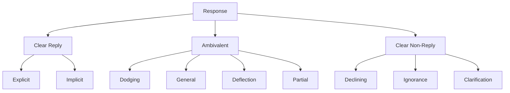
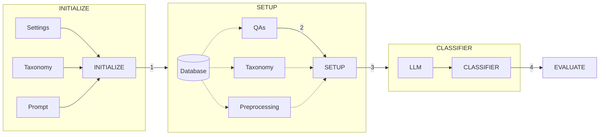
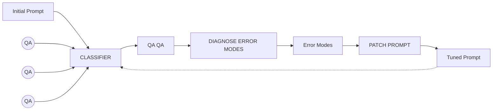

# Unmasking Political Question Evasions

## LLM-First Approach with Iterative Prompt Repair for Classifying Evasion in Political Interviews

Omar Elbeltagui, Nils Knittel, Leonie Süß, Umut Yıldırır, Qiyan Zhai, Shaghayegh Kolli, Jana Diesner
Technical University of Munich

## INTRODUCTION

Politicians often avoid giving direct responses in interviews, undermining accountability. Subtle evasions are difficult
to capture with rule-based approaches. This project aims to further unmask such evasions using advanced NLP techniques.

## SEMEVAL TASK

**Task 1: Clarity-Level Classification**
Coarse-grained assessment of whether an answer directly addresses the question.

**Task 2: Evasion-Technique Classification**
Fine-grained categorization of specific evasive behaviors used in political responses.

Figure 1: Taxonomy of political answer clarity and evasion techniques used in SemEval tasks.1

## METHODOLOGY

1. **End-to-end pipeline:** Java-based orchestration for data import, LLM calls, and evaluation
2. **Iterative prompt repair:** Automated diagnose-and-patch loop using LLM feedback
3. **Data preparation:** Toolkit for cleaning and preprocessing the dataset, allowing different customized cleaning
   combinations
4. **Evasion based mapping:** Categorizing into customized finer evasion techniques and mapping back to standard labels

## CLASSIFICATION PIPELINE

Figure 2: End-to-end classification pipeline from interview input to clarity and evasion labels.

## PROMPT ENHANCEMENT PIPELINE

Figure 3: Iterative prompt enhancement loop using LLM feedback and error diagnosis.

## CLASSIFICATION EXAMPLE

<table>
  <tbody>
    <tr>
        <td>Question: Do you see a risk of triggering a wider war?</td>
        <td>Evasion Technique: Dodging</td>
    </tr>
    <tr>
        <td>Answer: I thought you were going to ask me about the pig.</td>
        <td>Clarity Level Mapping: Ambivalent</td>
    </tr>
    <tr>
        <td colspan="2">Explanation: The interviewer asks directly whether there is a risk of triggering a wider war. The interviewee does not address that risk at all (...)</td>
    </tr>
  </tbody>
</table>

## DATASET & PREPROCESSING

Experiments are based on the **QEvasion**2 dataset, containing political question-answer pairs annotated for
clarity and evasion behavior.

**Core Fields**

* `interview_question`, `interview_answer`, Normalized question used for prompting, clarity and evasion labels

**Preprocessing**
<table>
  <thead>
    <tr>
        <th>Step 1: Spelling Fix</th>
        <th>Step 2: Word-Spacing Repair</th>
        <th>Step 3: Name &amp; Identifiers removal (OPTIONAL)</th>
        <th>Step 4: Filler-words clean-up (OPTIONAL)</th>
        <th>Step 5: Punctuation Normalisation</th>
    </tr>
  </thead>
  <tbody>
    <tr>
        <td>Fix spelling errors</td>
        <td>Fix incorrect spacing</td>
        <td>Strip Names, Identifiers and honorifics.</td>
        <td>Discard filler-words and multi-phrase fillers.</td>
        <td>Fix existing and introduced punctuation errors</td>
    </tr>
    <tr>
        <td>**TOOLS** NLTK RapidFuzz wordfreq</td>
        <td>**TOOLS** NLTK WordNinja wordfreq</td>
        <td>**TOOLS** REGEX spaCy</td>
        <td>**TOOLS** REGEX spaCy</td>
        <td>**TOOLS** REGEX</td>
    </tr>
    <tr>
        <td>**Before** onetry due to environentl constraints</td>
        <td>**Before** onetry due to environmental constraints</td>
        <td>**Before** Mr. Biden, will you sign the bill?</td>
        <td>**Before** Well, by the end of the day, it's not yet decided</td>
        <td>**Before** , ,it's not yet decided</td>
    </tr>
    <tr>
        <td>**After** onetry due to environmental constraints</td>
        <td>**After** one try due to environmental constraints</td>
        <td>**After** will you sign the bill?</td>
        <td>**After** it's not yet decided</td>
        <td>**After** it's not yet decided</td>
    </tr>
  </tbody>
</table>
Figure 4: Dataset preprocessing pipeline including normalization, cleaning, and text correction steps, using spaCy3, Word Ninja4, NLTK5, RapidFuzz6 and wordfreq7.

## EXPERIMENTAL RESULTS

<table>
  <thead>
    <tr>
        <th></th>
        <th rowspan="2">Model Variant</th>
        <th colspan="2">Clarity Categories</th>
        <th colspan="2">Evasion Techniques</th>
    </tr>
    <tr>
        <th>Acc</th>
        <th>F1</th>
        <th>Acc</th>
        <th>F1</th>
        <th></th>
    </tr>
  </thead>
  <tbody>
    <tr>
        <td>Baseline</td>
        <td></td>
        <td></td>
        <td></td>
        <td></td>
        <td></td>
    </tr>
    <tr>
        <td>Llama 3.18 8B</td>
        <td>0.685</td>
        <td>0.451</td>
        <td>0.311</td>
        <td>0.182</td>
        <td></td>
    </tr>
    <tr>
        <td>GPT 5.29 (Direct)</td>
        <td>0.773</td>
        <td>0.708</td>
        <td>0.477</td>
        <td>0.438</td>
        <td></td>
    </tr>
    <tr>
        <td>Evasion-based Mapping</td>
        <td></td>
        <td></td>
        <td></td>
        <td></td>
        <td></td>
    </tr>
    <tr>
        <td>GPT 5.2</td>
        <td>0.831</td>
        <td>0.776</td>
        <td>0.477</td>
        <td>0.438</td>
        <td></td>
    </tr>
    <tr>
        <td>Refined Prompt</td>
        <td></td>
        <td></td>
        <td></td>
        <td></td>
        <td></td>
    </tr>
    <tr>
        <td>GPT 5.2</td>
        <td>**0.831**</td>
        <td>**0.797**</td>
        <td>**0.617**</td>
        <td>**0.573**</td>
        <td></td>
    </tr>
  </tbody>
</table>
Table 1: Performance of baseline and model variants on clarity and evasion subtasks.

<table>
  <thead>
    <tr>
        <th>Task / Work</th>
        <th>Acc</th>
        <th>Prec</th>
        <th>Rec</th>
        <th>F1</th>
    </tr>
  </thead>
  <tbody>
    <tr>
        <td>Clarity Categories</td>
        <td></td>
        <td></td>
        <td></td>
        <td></td>
    </tr>
    <tr>
        <td>Ours</td>
        <td>**0.831**</td>
        <td>**0.809**</td>
        <td>**0.787**</td>
        <td>**0.797**</td>
    </tr>
    <tr>
        <td>Thomas et al. (2024)</td>
        <td>0.713</td>
        <td>0.67</td>
        <td>0.71</td>
        <td>0.682</td>
    </tr>
  </tbody>
</table>
Table 2: Direct comparison of our approach with prior work on clarity classification.

<table>
  <thead>
    <tr>
        <th>Iteration</th>
        <th>Clarity F1-score</th>
    </tr>
  </thead>
  <tbody>
    <tr>
        <td>0</td>
        <td>0.778</td>
    </tr>
    <tr>
        <td>1</td>
        <td>0.772</td>
    </tr>
    <tr>
        <td>2</td>
        <td>0.765</td>
    </tr>
    <tr>
        <td>3</td>
        <td>0.792</td>
    </tr>
    <tr>
        <td>4</td>
        <td>0.775</td>
    </tr>
    <tr>
        <td>5</td>
        <td>0.765</td>
    </tr>
    <tr>
        <td>6</td>
        <td>0.788</td>
    </tr>
    <tr>
        <td>7</td>
        <td>0.788</td>
    </tr>
    <tr>
        <td>8</td>
        <td>0.802</td>
    </tr>
    <tr>
        <td>9</td>
        <td>0.785</td>
    </tr>
    <tr>
        <td>10</td>
        <td>0.768</td>
    </tr>
    <tr>
        <td>11</td>
        <td>0.778</td>
    </tr>
    <tr>
        <td>12</td>
        <td>0.775</td>
    </tr>
  </tbody>
</table>
Figure 5: F1-score progression for clarity classification across prompt refinement iterations.

<table>
  <thead>
    <tr>
        <th>Iteration</th>
        <th>Evasion F1-score</th>
    </tr>
  </thead>
  <tbody>
    <tr>
        <td>0</td>
        <td>0.445</td>
    </tr>
    <tr>
        <td>1</td>
        <td>0.502</td>
    </tr>
    <tr>
        <td>2</td>
        <td>0.495</td>
    </tr>
    <tr>
        <td>3</td>
        <td>0.518</td>
    </tr>
    <tr>
        <td>4</td>
        <td>0.568</td>
    </tr>
    <tr>
        <td>5</td>
        <td>0.560</td>
    </tr>
    <tr>
        <td>6</td>
        <td>0.562</td>
    </tr>
    <tr>
        <td>7</td>
        <td>0.575</td>
    </tr>
    <tr>
        <td>8</td>
        <td>0.578</td>
    </tr>
    <tr>
        <td>9</td>
        <td>0.542</td>
    </tr>
    <tr>
        <td>10</td>
        <td>0.545</td>
    </tr>
    <tr>
        <td>11</td>
        <td>0.558</td>
    </tr>
    <tr>
        <td>12</td>
        <td>0.573</td>
    </tr>
  </tbody>
</table>
Figure 6: F1-score gains for evasion technique classification through iterative prompt repair.

## DISCUSSION & CONCLUSION

**Key Insights**

* Iterative prompt repair yields consistent improvements
* LLM-first approach captures subtle evasion patterns
* Cleaning improves data quality, but does not translate into clear metric gains under the current setup

**Discussion**

* API costs and latency considerations
* Limited local baseline comparisons
* QA summarization (BART/BERT) was prototyped but not used due to uncertain alignment with the evasion taxonomy and lack
  of reliable validation

**Future Work**

* Treat preprocessing as a configurable policy and search for the best flag combination
* Revisit BERT/BART summarization as a preprocessing stage for long-context cases and evaluate its impact under the
  various configuration

**References**

1. K. Thomas, G. Filandrianos, M. Lymperaiou, C. Zerva, and G. Stamou, "'I Never Said That': A dataset, taxonomy and
   baselines on response clarity classification," Findings of the Association for Computational Linguistics: EMNLP 2024,
   pp. 5204–5233, Jan. 2024, doi:10.18653/v1/2024.findings-emnlp.300.
2. "QEvasion Dataset," huggingface.co, Oct. 10, 2024. https://huggingface.co/datasets/ailsntua/QEvasion.
3. "spaCy · Industrial-strength Natural language processing in Python." https://spacy.io/
4. D. Anderson, "Word Ninja: Probabilistically split concatenated words using NLP based on English Wikipedia unigram
   frequencies," GitHub. https://github.com/keredson/wordninja/.
5. "NLTK :: Natural Language Toolkit." https://www.nltk.org/.
6. "RapidFuzz: Rapid fuzzy string matching in Python using various string metrics,"
   GitHub. https://github.com/rapidfuzz/RapidFuzz.
7. "wordfreq," PyPI, Nov. 21, 2023. https://pypi.org/project/wordfreq/.
8. Meta, "Introducing Llama 3.1: Our most capable models to date," Meta, Jul. 23,
    2024. https://ai.meta.com/blog/meta-llama-3-1/.
9. OpenAI, "Introducing GPT-5.2 The most advanced frontier model for professional work and long-running agents.,"
   OpenAI, Dec. 11, 2025. https://openai.com/index/introducing-gpt-5-2/.

**Contact**
go29kut@tum.de
leonie.suess@tum.de
umut.yldrr@tum.de
nils.knittel@tum.de
qiyan.zhai@tum.de

**GitHub**
The image contains a QR code for the GitHub repository.